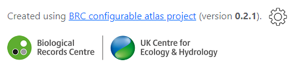

# Using the admin utilities
This page explains how to use the admin utilities that are integrated into your website. These utilities often generate data but it is important to note that the data files are not generated directly in your repo. They are effectively generated and saved to files (or zipfiles) on your computer. Uploading the files to your repo is described in the document [*Using GitHub ot add/edit files*](./docs-add-edit-config.md).

So there is no need to worry that these admin utilities are publicly visible to anyone using your atlas website - anyone can use them, but only to generate data files from a CSV which they already have.

To reach the admin utilities, click on the gear wheel on the right of your website's footer:

That will take you to a list of utilities accessible by clicking on the corresponding button. These are each described below:

## Generate atlas data from a biological records CSV
Use this utility to select a CSV file of biological records from your computer from which to generate all the data files that will drive your atlas site. The file you select is not uploaded - it is only used to generate the atlas data files which are zipped and saved to a folder on your computer.

Use the *Choose file* button to open a CSV file containing biological records. No format (e.g. column names) are mandated for this CSV, but to leverage all the mapping and charting functionality possible in the atlas website, you will need three or four columns specifying this information for each record:

1. The name of the taxon recorded.
2. A grid reference (British or Irish) for the record.
3. A date for the record (or representing the start date of a date range).
4. (Optionally) a date for the record representing the end date of a date range.

After selecting your CSV file, you set the mappings for each of these fields by selecting a column name from your CSV against each of the drop-down lists. As you set each of the mappings, the 'generate' controls, which are initially disabled, become enabled when you have specified enough information for them (as described in the sections below).

Note that if your CSV only includes one data column, then specify that column for both the date start and date end fields.

When each of the 'generate' buttons is used, the utility generates the data and compresses it into a zip file called *download.zip*. Your browser will then do whatever it normally does with downloaded files. For example Chrome asks you where you want to save the downloaded file. Once each *download.zip* file is downloaded, you can unzip it to access the generated data files which need to be uploaded to your forked repo (as described in the sections below and in the document [*Using GitHub to add/edit files*](./docs-add-edit-config.md)). 

### Generate species list
The *Generate species list* button is enabled as soon as you have set the mapping for the taxon name field. Clicking this button generates a file called *taxa.csv* which contains two columns: *taxon_id* and *taxon*. The field *taxon* contains the unique names of the taxa from your input CSV (from the column you specified in the mappings) and the *taxon_id* field contains a unique key for that taxon which is based on the taxon name (e.g. by replacing all spaces with an underscore character). The significance of the *taxon_id* value is that it is used to name all the other individual data files (for mapping and charting) for each taxon.

**The *taxa.csv* file needs to be uploaded to the *user/data* folder of your repo.** Note that you can, if you wish, edit the values in the *taxon* field of this CSV - that's the name that appears to your website's users in the taxon selection control, but you *must NOT* edit the key values in the *taxon_id* field, or else you will lose the links to the other data files.

### Generate species info page stubs
The *Generate species info page stubs* button is enabled as soon as you have set the mapping for the taxon name field. Clicking this button generates a markdown file for each of the taxa in your spreadsheet. Each of the files contains the same example markdown and you will want to completely replace this with text and headers of your own design. The value of this utility is simply in creating the files with the correct names so that they can be found when the user selects a taxon.

For a bit more information on the *markdown* syntax, see the information on [Creating additional HTML or Markdown pages](./docs-additional-pages.md).

**The species information pages can be uploaded to the *user/data/captions* folder of your repo**. You can either upload them and then edit them there, or you can edit them on your computer before uploading them. It is only necessary to upload files for the species for which you have information to add.

### Generate atlas map data
To enable the *Generate atlas map data* controls, you need to specify mappings for all four fields (because the generated map atlas data includes the earliest and latest years). Once the controls are enabled, you need to use the sliders to indicate which resolution atlas data you want to generate. You must specify at least one of these to enable to *Generate atlas map data* button, but you can specify all four if you are going to make all atlas mapping precisions available to your users.

The downloaded zipfile will contain a sub-folder corresponding to each of the resolutions you specified. **These subfolders, complete with their contents, must be uploaded to the *user/data* folder of your repo**.

### Generate chart data
To enable the *Generate chart map data* controls, you need to specify mappings for the taxon name and both date fields. Once the controls are enabled, you need to use the sliders to indicate which charts you wish to generate data for. You must specify one or both of these to enable the *Generate chart map data* button.

The downloaded zipfiel will contain a sub-folder corresponding to each of the charts you specified. **These subfolders, complete with their contents, must be uploaded to the *user/data* folder of your repo**.
